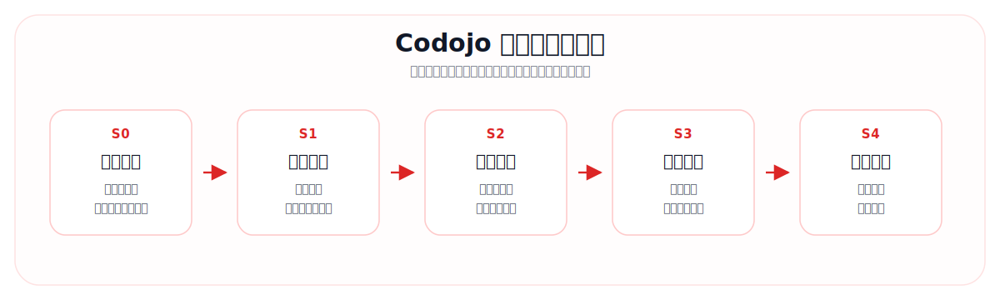
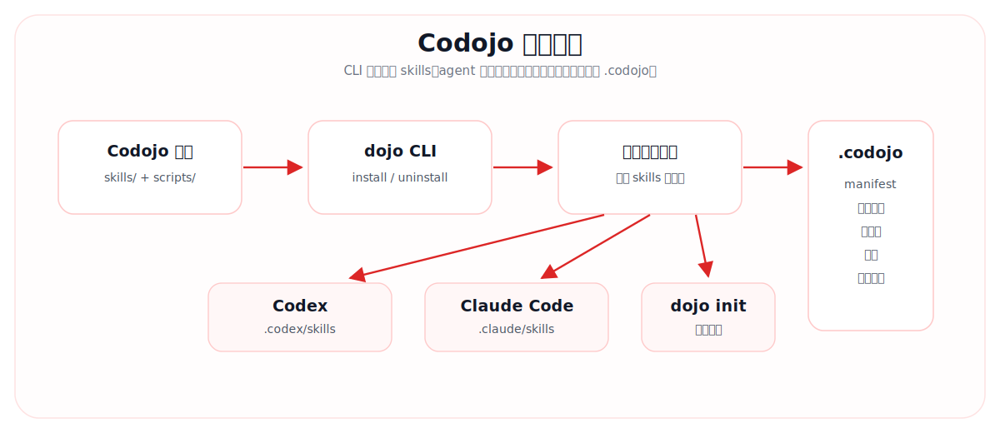
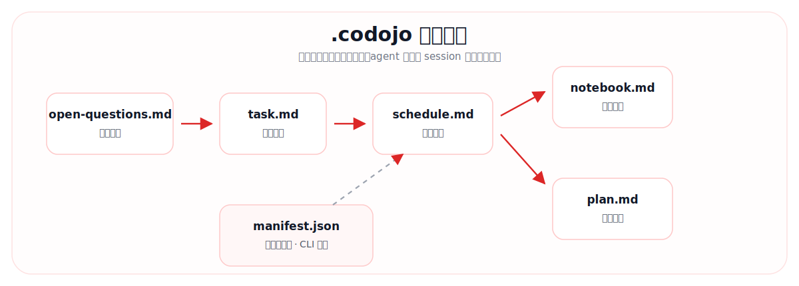

<div align="center">


# Codojo

### 代码道场：让 AI 陪你从「看不懂项目」到「能独立魔改」

[](package.json)
[](https://nodejs.org)
[](#-安装)
[](#-安装)
[](LICENSE)

**Code Dojo · 代码道场**

[English](README_en.md) · 简体中文

[快速开始](#-快速开始) · [学习流程](#-学习流程) · [文件协议](#-文件协议) · [Skills](#-skills) · [CLI](#-cli)

</div>

---

## 简介

Codojo 是一个面向 Codex 和 Claude Code 的代码道场。

它不是简单的「解释代码」工具，而是一套围绕真实项目展开的学习协议：AI 先扫描项目，再评估你的能力，生成专属学习计划，然后按知识点带你完成理论理解和代码实践。所有进度都会沉淀到 `.codojo/`，实现跨 session 续学。

适合这些场景：

- 学生想快速上手一个开源项目
- 新人接手公司已有项目，需要建立项目全貌
- 从业者迁移技术栈，想围绕真实代码学习
- 学完项目后，希望做一个小型功能魔改来检验理解

---

## 核心理念

### 文件即进度

Codojo 不依赖单次聊天上下文保存学习状态，而是把评估结果、学习计划、进度表、笔记和魔改方案写入目标项目的 `.codojo/` 目录。

这意味着你可以：

- 新开 session 后继续学习
- 让 AI 重新读取学习状态
- 回看自己学过什么、跳过什么、卡在哪里
- 把学习过程和项目代码一起管理

### 真实代码驱动

每个知识点都必须绑定项目里的真实文件，理论讲解之后会进入实践任务。实践不是虚构 demo，而是在目标项目中做小而明确的改动。

用户可以选择完成实践，也可以明确跳过；AI 会把状态写回进度文件。

---

## 学习流程



| 阶段 | Skill | 做什么 | 产出 |
|---|---|---|---|
| S0 项目扫描 | `dojo-init` / `dojo-stage` | 读取方法论，扫描项目结构、技术栈和当前进度 | 路由到正确阶段 |
| S1 能力评估 | `dojo-assess` | 根据项目技术栈生成问卷，逐题确认用户基础 | `open-questions.md` |
| S2 计划生成 | `dojo-plan` | 生成个性化学习路径和进度表 | `task.md`、`schedule.md` |
| S3 正式教学 | `dojo-teach` | 按知识点进行理论讲解和真实代码实践 | 持续更新 `schedule.md` |
| S4 项目魔改 | `dojo-hack` | 学完后提出改造方向，并协助实现 | `plan.md` 和代码改动 |

辅助技能：

| Skill | 用途 |
|---|---|
| `dojo-stage` | 阶段路由器，根据 `.codojo/` 自动判断当前进度 |
| `dojo-reset` | 回退到指定学习阶段 |
| `dojo-notebook` | 记录和整理学习笔记 |
| `dojo-quiz` | 阶段性知识检测 |

---

## 系统结构



---

## 快速开始

### 1. 克隆 Codojo

```bash
git clone <repo-url>
cd codojo
```

当前本地开发版推荐用 `npm link` 注册 CLI：

```bash
npm link
```

确认命令可用：

```bash
dojo --help
```

### 2. 安装到目标项目

进入你想学习的代码项目：

```bash
cd /path/to/your/project
dojo install
```

默认使用当前目录作为目标项目。也就是说，`npm link` 在 Codojo 仓库中执行，`dojo install` 在你要学习的代码仓中执行。

如果新开终端后 `dojo` 命令失效，可以在任意目录执行一次：

```bash
dojo install --fix-shell
```

它会把当前 npm 全局 bin 目录写入 shell profile（如 `~/.zshrc` 或 `~/.bashrc`）。普通 `dojo install` 不会修改 shell 配置，也不会输出这类修复提示。

默认会同时安装到：

```text
.codex/skills/
.claude/skills/
.codojo/manifest.json
```

只安装 Codex：

```bash
dojo install -t codex
```

只安装 Claude Code：

```bash
dojo install -t claude
```

也可以从任意目录指定目标项目：

```bash
dojo install --path /path/to/your/project
```

`dojo install` 是幂等的，可以重复执行。它只更新 Codojo 受管的 `_shared` 和 `dojo-*` skills，不会删除其他 skills，也不会删除 `.codojo/` 学习文件。

### 3. 启动学习

安装完成后，在目标项目中打开 Codex 或 Claude Code，对 agent 说：

```text
dojo init
```

也可以使用这些启动关键词：

```text
道场启动
开始学习
启动
dojo start
```

注意：`dojo init` 是对话里的 skill 触发关键词，不是 CLI 命令。

---

## CLI

当前 CLI 只负责安装、状态查看、更新、卸载和管理 skills。

```bash
dojo install
dojo install -t codex
dojo install -t claude
dojo install --path /path/to/project
```

```bash
dojo status
dojo status -t codex
dojo status --path /path/to/project
```

```bash
dojo update
dojo update -t claude
dojo update --path /path/to/project
```

```bash
dojo uninstall -y
dojo uninstall -t codex -y
dojo uninstall -t claude -y
dojo uninstall --path /path/to/project -y
```

参数说明：

| 参数 | 说明 |
|---|---|
| `-t, --tools` | 指定目标工具：`codex`、`claude`、`codex,claude`、`all` |
| `--path` | 指定目标项目目录，默认当前目录 |
| `-y, --yes` | 卸载确认，只用于 `uninstall` |
| `--force` | 兼容旧安装用法；当前安装默认幂等更新 |
| `--fix-shell` | 将 npm 全局 bin 写入 shell profile，修复新终端找不到 `dojo` |

`dojo status` 会读取目标项目的 `.codojo/manifest.json`，并检查 Codex / Claude Code 目录中的 `_shared` 和 `dojo-*` skills 是否完整。

`dojo update` 会先在 Codojo 本体仓库执行 `git pull --ff-only`，然后对目标项目执行一次幂等安装。它只更新受管 skills，会保留 `.codojo/` 学习进度。

---

## 文件协议

安装后，Codojo 会在目标项目创建 `.codojo/`，用于保存学习状态。



```text
<your-project>/.codojo/
├── manifest.json        # 安装元数据
├── open-questions.md    # S1 能力评估结果
├── task.md              # S2 学习计划
├── schedule.md          # S2 生成，S3 持续更新的进度表
├── plan.md              # S4 魔改计划
└── notebook.md          # 学习笔记
```

其中 `manifest.json` 由 CLI 管理。其他学习产物由 skills 在流程中生成和更新。

---

## Skills

Codojo 当前包含 9 个 skills：

```text
dojo-init       初始化入口，读取方法论并进入阶段路由
dojo-stage      阶段路由器，判断当前该做什么
dojo-assess     能力评估，生成并记录问卷
dojo-plan       学习计划生成
dojo-teach      正式教学，理论 + 实践
dojo-quiz       阶段测验
dojo-notebook   学习笔记
dojo-reset      进度回档
dojo-hack       项目魔改
```

共享方法论位于：

```text
skills/_shared/methodology.md
skills/_shared/output-style-guide.md
```

---

## 教学协议

S3 教学阶段遵循严格的交互节奏：

1. AI 讲解一个知识点，引用项目真实代码
2. 用户回复「理解」后，才进入实践
3. AI 布置小范围真实代码改动
4. 用户完成后回复「完成」
5. AI 检查改动并更新 `schedule.md`

用户可以在实践阶段选择跳过，AI 会在进度表中记录为跳过。

---

## 卸载

卸载 Codojo 受管 skills：

```bash
dojo uninstall -y
```

卸载只删除：

```text
.codex/skills/dojo-*
.codex/skills/_shared/
.claude/skills/dojo-*
.claude/skills/_shared/
```

卸载会保留 `.codojo/`，避免删除用户学习进度。

---

## 设计边界

Codojo 第一版只支持：

- Codex
- Claude Code
- Node.js CLI
- skills 作为主要载体
- 手动 `dojo update`

暂不支持：

- 独立教学 Web UI
- `dojo init` CLI 命令
- 后台自动更新
- npm 发布通道

---

## 许可证

MIT
