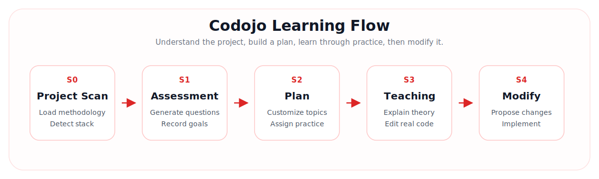
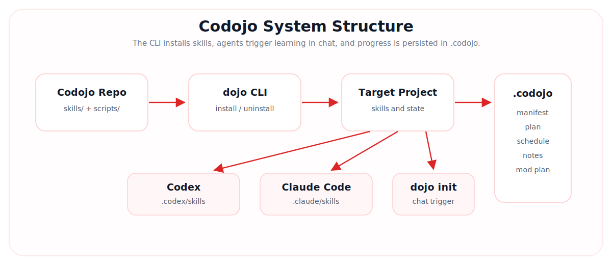
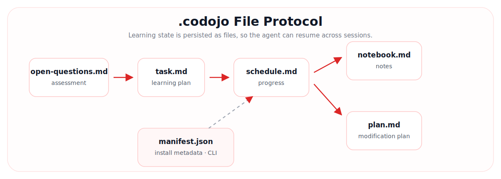

<div align="center">


# Codojo

### A code dojo where AI helps you go from "I cannot read this project" to "I can modify it"

[](package.json)
[](https://nodejs.org)
[](#quick-start)
[](#quick-start)
[](LICENSE)

**Code Dojo · 代码道场**

English · [简体中文](README.md)

[Quick Start](#quick-start) · [Learning Flow](#learning-flow) · [File Protocol](#file-protocol) · [Output Examples](#output-examples) · [Skills](#skills) · [CLI](#cli)

</div>

---

## Introduction

Codojo is a code-learning dojo for Codex and Claude Code.

It is not a generic "explain this code" prompt pack. Codojo defines a project-centered learning protocol: the agent scans the codebase, assesses your current ability, generates a personalized learning plan, and then teaches each topic through theory plus real code practice. Progress is persisted in `.codojo/`, so learning can continue across sessions.

It is designed for:

- Students onboarding into an open-source project
- Engineers taking over an existing codebase
- Developers learning a new stack through a real project
- Learners who want to validate understanding through a small project modification

---

## Core Ideas

### Progress as Files

Codojo does not depend on a single chat session to remember progress. Assessment results, learning plans, schedules, notes, and modification plans are written into `.codojo/` inside the target project.

This lets you:

- Continue learning in a new session
- Ask the agent to reload current progress
- Review what was learned, skipped, or blocked
- Keep the learning process close to the codebase

### Real-Code Learning

Every topic must connect to real files in the target project. After theory, Codojo asks you to make a small, concrete code change. You can complete the practice task or explicitly skip it; either way, progress is recorded.

---

## Learning Flow



| Stage | Skill | What it does | Output |
|---|---|---|---|
| S0 Project Scan | `dojo-init` / `dojo-stage` | Loads methodology, scans the project, and detects current progress | Routes to the right stage |
| S1 Assessment | `dojo-assess` | Generates a project-specific questionnaire and records answers | `open-questions.md` |
| S2 Plan | `dojo-plan` | Creates a personalized learning path and progress schedule | `task.md`, `schedule.md` |
| S3 Teaching | `dojo-teach` | Teaches topic by topic with theory and real code practice | Updates `schedule.md` |
| S4 Modification | `dojo-hack` | Proposes and implements project modifications after learning | `plan.md` and code changes |

Helper skills:

| Skill | Purpose |
|---|---|
| `dojo-stage` | Routes to the correct stage based on `.codojo/` |
| `dojo-reset` | Rolls progress back to a selected stage |
| `dojo-notebook` | Records and organizes learning notes |
| `dojo-quiz` | Runs lightweight knowledge checks |

---

## System Structure



---

## Quick Start

### 1. Clone Codojo

```bash
git clone <repo-url>
cd codojo
```

For the current local development version, register the CLI with:

```bash
npm link
```

Verify the command:

```bash
dojo --help
```

### 2. Install into a Target Project

Enter the project you want to learn:

```bash
cd /path/to/your/project
dojo install
```

The current directory is the default target project. In other words, run `npm link` inside the Codojo repository, then run `dojo install` inside the code repository you want to learn.

If `dojo` disappears after opening a new terminal, run once from any directory:

```bash
dojo install --fix-shell
```

It writes the current npm global bin directory into your shell profile, such as `~/.zshrc` or `~/.bashrc`. Plain `dojo install` does not modify shell configuration and does not print this repair hint.

By default, Codojo installs into:

```text
.codex/skills/
.claude/skills/
.codojo/manifest.json
```

Codex only:

```bash
dojo install -t codex
```

Claude Code only:

```bash
dojo install -t claude
```

Install from any directory by passing a target path:

```bash
dojo install --path /path/to/your/project
```

`dojo install` is idempotent. It updates only Codojo-managed `_shared` and `dojo-*` skills, preserves unrelated skills, and never deletes `.codojo/` learning files.

### 3. Start Learning

After installation, open Codex or Claude Code in the target project and tell the agent:

```text
dojo init
```

Alternative triggers:

```text
道场启动
开始学习
启动
dojo start
```

Note: `dojo init` is a chat trigger for the skill workflow, not a CLI command.

---

## CLI

The CLI installs, checks, updates, uninstalls, and manages skills.

```bash
dojo install
dojo install -t codex
dojo install -t claude
dojo install --path /path/to/project
```

```bash
dojo status
dojo status -t codex
dojo status --path /path/to/project
```

```bash
dojo update
dojo update -t claude
dojo update --path /path/to/project
```

```bash
dojo uninstall -y
dojo uninstall -t codex -y
dojo uninstall -t claude -y
dojo uninstall --path /path/to/project -y
```

Options:

| Option | Description |
|---|---|
| `-t, --tools` | Target tools: `codex`, `claude`, `codex,claude`, or `all` |
| `--path` | Target project path. Defaults to the current directory |
| `-y, --yes` | Required confirmation for `uninstall` |
| `--force` | Legacy compatibility. Install is already idempotent |
| `--fix-shell` | Writes npm global bin into the shell profile so `dojo` works in new terminals |

`dojo status` reads `.codojo/manifest.json` in the target project and checks whether `_shared` and `dojo-*` skills are complete under Codex / Claude Code.

`dojo update` runs `git pull --ff-only` in the Codojo source repository, then performs one idempotent install into the target project. It updates only managed skills and preserves `.codojo/` learning progress.

---

## File Protocol

Codojo stores learning state in `.codojo/` inside the target project.



```text
<your-project>/.codojo/
├── manifest.json        # install metadata
├── open-questions.md    # S1 assessment result
├── task.md              # S2 learning plan
├── schedule.md          # S2 schedule, updated during S3
├── plan.md              # S4 modification plan
└── notebook.md          # learning notes
```

`manifest.json` is managed by the CLI. Other files are created and updated by skills during the learning workflow.

---

## Skills

Codojo currently includes 9 skills:

```text
dojo-init       Entry point. Loads methodology and routes to stage detection
dojo-stage      Stage router. Decides what should happen next
dojo-assess     Assessment. Generates and records the questionnaire
dojo-plan       Learning plan generator
dojo-teach      Teaching loop with theory and practice
dojo-quiz       Lightweight knowledge checks
dojo-notebook   Learning notes
dojo-reset      Progress rollback
dojo-hack       Project modification stage
```

Shared methodology files:

```text
skills/_shared/methodology.md
skills/_shared/output-style-guide.md
```

---

## Teaching Protocol

S3 follows a strict interaction rhythm:

1. The agent explains one topic and references real project files
2. The user replies "理解" or confirms understanding
3. The agent assigns a small real-code practice task
4. The user replies "完成" after finishing
5. The agent checks the change and updates `schedule.md`

Users may skip a practice task. The skipped state is recorded in the progress file.

---

## Uninstall

Remove Codojo-managed skills:

```bash
dojo uninstall -y
```

Uninstall removes only:

```text
.codex/skills/dojo-*
.codex/skills/_shared/
.claude/skills/dojo-*
.claude/skills/_shared/
```

`.codojo/` is preserved so learning progress is not lost.

---

## Scope

The first version supports:

- Codex
- Claude Code
- Node.js CLI
- Skills as the main carrier
- Manual `dojo update`

Not supported yet:

- Standalone teaching web UI
- npm release channel

---

## Output Examples

The examples below simulate Codojo outputs for [CyberClaw](https://github.com/ttguy0707/CyberClaw). They show the rough shape of `.codojo/` learning files and intentionally exclude the CLI-managed `manifest.json`.

### `open-questions.md`

```markdown
# Skill Assessment: [CyberClaw](https://github.com/ttguy0707/CyberClaw)

## Project Profile

- Language: Python 3.10+
- Core frameworks: LangGraph, LangChain
- Key modules: transparent audit, two-phase skill calls, dual-watermark memory, heartbeat tasks, sandbox tools
- Entry files: entry/cli.py, entry/main.py, entry/monitor.py
- Core files: cyberclaw/core/agent.py, context.py, skill_loader.py, heartbeat.py

## Questionnaire

1. How familiar are you with Python package structure, virtual environments, and `pip install -e .`?
   - A. Not familiar at all
   - B. Can run the project, but do not understand the package structure
   - C. Can read `setup.py` and imports
   - D. Can maintain Python CLI projects

2. How familiar are you with LangGraph / LangChain agent orchestration?
   - A. Never heard of them
   - B. Heard of them but never used them
   - C. Built simple chains
   - D. Can design complex agent graphs

3. Do you understand JSONL audit logs and event buses?
   - A. No
   - B. I know what logs are
   - C. I can read event flows
   - D. I can design traceable audit systems

## Free Notes

- Daily time budget: 45 minutes
- Goal: understand the core agent execution path, then add filtering to the monitor
- Preference: fewer abstract explanations, more walkthroughs using real files
```

### `task.md`

```markdown
# [CyberClaw](https://github.com/ttguy0707/CyberClaw) Learning Plan

| ID | Topic | Files | Theory Goal | Practice Task | Status |
|---|---|---|---|---|---|
| T01 | Python CLI and editable install | setup.py, entry/cli.py | Understand how local commands are registered | Add a read-only `--version` option | Not started |
| T02 | Config loading and environment variables | cyberclaw/core/config.py, .env.example | Understand config sources and defaults | Add one safe config option and document it | Not started |
| T03 | Agent main loop | cyberclaw/core/agent.py | Understand how input reaches the model and tools | Add one debug log in the critical path | Not started |
| T04 | Two-phase skill calls | cyberclaw/core/skill_loader.py | Understand the help -> run boundary | Add a friendly error for missing skill docs | Not started |
| T05 | Dual-watermark memory | cyberclaw/core/context.py | Understand long-term profile and short-term summary | Adjust the summary threshold and observe tests | Not started |
| T06 | Heartbeat tasks | cyberclaw/core/heartbeat.py | Understand task persistence and execution | Show a status field in the task list | Not started |
| T07 | Transparent audit logs | cyberclaw/core/logger.py, entry/monitor.py | Understand how the 5 event types are recorded | Add event-type filtering to the monitor | Not started |
```

### `schedule.md`

```markdown
# Learning Progress

Overall progress: 2 / 7

| ID | Status | Last Note |
|---|---|---|
| T01 | Done | Understood `setup.py` entry_points and completed the `--version` practice |
| T02 | Done | Added a config option and passed tests |
| T03 | In progress | Theory finished; waiting for the user to say "understood" before practice |
| T04 | Not started | - |
| T05 | Not started | - |
| T06 | Not started | - |
| T07 | Not started | - |

Next: continue T03 and explain how `cyberclaw/core/agent.py` connects model calls, tool calls, and audit events.
```

### `notebook.md`

```markdown
# Learning Notes

## Python CLI

`entry_points` in `setup.py` maps the `cyberclaw` command to `entry.cli:main`. During local development, `pip install -e .` lets code changes take effect without reinstalling the package.

## Two-Phase Skill Calls

CyberClaw does not execute skills immediately. It reads the `SKILL.md` instructions first, then enters the run phase. This reduces black-box tool execution risk and gives the user a chance to interrupt before execution.

## Transparent Audit

Audit logs use JSONL: one event per line. Compared with plain text logs, JSONL is easier to filter, replay, and render in monitoring UIs.
```

### `plan.md`

```markdown
# [CyberClaw](https://github.com/ttguy0707/CyberClaw) Modification Plan

## Direction A: Monitor Event Filtering

Goal: add event-type filtering to `entry/monitor.py`, so users can show only `tool_call`, `tool_result`, or `ai_message`.

Tasks:

- [ ] Trace how the monitor reads JSONL today
- [ ] Add a `--event-type` CLI option
- [ ] Filter events before rendering
- [ ] Add or update tests

Acceptance:

- `cyberclaw monitor --event-type tool_call` shows only tool-call events
- The default behavior stays unchanged when no filter is provided
```

---

## License

MIT
